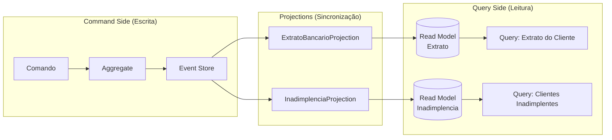

# Event Sourcing

> **Pré-requisito**: [Event-Driven Architecture — Fundamentos](./01-event-driven-vs-sourcing.md)  
> **Próximo documento**: [Pub/Sub](./03-pub-sub.md)

---

## O que é Event Sourcing?

Event Sourcing é um **padrão de persistência** onde o estado de uma entidade não é salvo
diretamente. Em vez disso, a **sequência de eventos que levou a esse estado** é o que
fica armazenado.

Para saber o estado atual, aplica-se os eventos em ordem (replay).

```
Abordagem tradicional:
  Tabela cobrancas:
  │ id      │ status │ valor │
  │ abc-123 │ Paga   │ 500   │
  A pergunta "quando foi pago? quem pagou? havia sido vencida antes?" não tem resposta.

Event Sourcing:
  Tabela eventos:
  │ aggregate_id │ versao │ tipo                  │ ocorrido_em │
  │ abc-123      │ 1      │ CobrancaCriada        │ 01/01       │
  │ abc-123      │ 2      │ CobrancaVencida       │ 10/01       │
  │ abc-123      │ 3      │ PagamentoRegistrado   │ 16/01       │
  Toda a história está lá. Status atual = resultado de aplicar os 3 eventos.
```

---

## Por que Event Sourcing existe?

O problema que motivou o padrão:

**Auditoria é um requisito de negócio, não uma feature técnica.** Em sistemas financeiros,
de saúde, jurídicos e regulatórios, é obrigatório saber: quem fez o quê, quando, em qual
estado estava o dado antes. A abordagem tradicional (salvar estado atual) descarta essa
informação no momento do UPDATE.

A alternativa convencional — tabelas de auditoria, triggers, tabelas de histórico —
é implementada depois, de forma separada, e frequentemente incompleta ou inconsistente.

Event Sourcing torna a auditoria o **mecanismo padrão de persistência**, não um add-on.

---

## Os cinco pilares

### 1. Aggregate — a unidade de consistência

O Aggregate é a **fronteira transacional** do Event Sourcing. Dentro de um aggregate,
a consistência é garantida. Entre aggregates, usa-se eventual consistency.

```
CobrancaAggregate
├── Id: Guid
├── CpfDevedor: string
├── Valor: decimal
├── Status: StatusCobranca    (Pendente | Paga | Cancelada | Vencida)
├── DataVencimento: DateOnly
├── Versao: long              (contador de eventos — usado para concorrência otimista)
└── EventosPendentes: List<AggregateEvent>   (acumulados antes de persistir)
```

O aggregate **não é** um modelo de banco de dados. É um modelo de domínio que encapsula
regras de negócio e produz eventos como resultado de comandos.

### 2. DomainEvent — o fato imutável

Um DomainEvent representa algo que **já aconteceu** no domínio. É sempre nomeado no
participio passado porque descreve um fato — não uma intenção.

```csharp
// ✗ Errado — nome no imperativo (intenção, não fato ocorrido)
public record RegistrarPagamento : AggregateEvent { ... }

// ✓ Correto — fato que aconteceu
public sealed record PagamentoRegistradoEvent : AggregateEvent
{
    public decimal ValorPago { get; init; }
    public string MetodoPagamento { get; init; }
    public DateTime PagoEm { get; init; }
}
```

**Propriedades obrigatórias de um evento:**
- `EventoId`: identidade única do evento (diferente do ID do aggregate)
- `OcorridoEm`: timestamp de quando o fato aconteceu
- `AggregateId`: a qual aggregate este evento pertence
- `Versao`: posição deste evento no histórico do aggregate

### 3. EventStore — banco de dados append-only

O Event Store é o repositório onde os eventos são persistidos. Só aceita INSERT —
nunca UPDATE ou DELETE.

```sql
CREATE TABLE eventos (
    aggregate_id  UUID          NOT NULL,
    versao        BIGINT        NOT NULL,
    nome_evento   VARCHAR(100)  NOT NULL,
    payload       JSONB         NOT NULL,
    ocorrido_em   TIMESTAMPTZ   NOT NULL DEFAULT NOW(),
    PRIMARY KEY (aggregate_id, versao)
);
```

A constraint `PRIMARY KEY (aggregate_id, versao)` é o mecanismo de **controle de
concorrência otimista**: dois processos tentando salvar na mesma versão causam violação
de PK — apenas um vence.

### 4. Versão — controle de concorrência otimista

```
Processo A: carrega CobrancaAggregate (versao = 3)
Processo B: carrega CobrancaAggregate (versao = 3)
                │
Processo A: cancela cobrança → tenta salvar versao = 4 → SUCESSO (versao no store = 3)
Processo B: registra pagamento → tenta salvar versao = 4 → VIOLAÇÃO DE PK (versao = 4!)
                │
Processo B: recebe ConcurrencyException → retorna erro → usuário pode tentar novamente
```

Comparação com locks pessimistas:

| | Lock Pessimista | Optimistic Concurrency |
|---|---|---|
| **Bloqueio** | Bloqueia outros processos durante a execução | Nenhum bloqueio |
| **Deadlock** | Possível | Impossível |
| **Throughput** | Cai em alta concorrência | Mantém-se bem — conflitos são raros |
| **Resolução** | Automática (um espera o outro) | Manual (erro retornado ao usuário) |
| **Ideal quando** | Conflitos frequentes | Conflitos raros |

Em sistemas bancários, dois processos modificando o **mesmo** aggregate ao **mesmo tempo**
é o cenário raro — optimistic concurrency é a escolha certa.

### 5. Replay — reconstituição do estado

```
EventStore: [CobrancaCriada(v1)] [CobrancaVencida(v2)] [PagamentoRegistrado(v3)]
                │
                ▼  Reconstituir(eventos)

Aplicar CobrancaCriadaEvent:
  Id = e.AggregateId, Valor = 500m, Status = Pendente, Versao = 1

Aplicar CobrancaVencidaEvent:
  Status = Vencida, Versao = 2

Aplicar PagamentoRegistradoEvent:
  Status = Paga, Versao = 3

Resultado: { Id: abc-123, Valor: 500, Status: Paga, Versao: 3 }
```

---

## Ciclo de vida — do comando ao evento

```
ESCRITA (Command Side)
─────────────────────

  Comando: "Registrar pagamento de R$ 500"
       │
       ▼
  CobrancaRepositorio.CarregarAsync(cobrancaId)
       │
       ▼  faz replay dos eventos do EventStore
  CobrancaAggregate reconstituída { Status: Pendente, Versao: 1 }
       │
       ▼
  cobranca.RegistrarPagamento(valor: 500m)
  → Validar: Status não é Paga nem Cancelada? ✓
  → Criar: PagamentoRegistradoEvent(Versao = 2)
  → Aplicar: Status = Paga, Versao = 2
  → Registrar: _eventosPendentes.Add(evento)
       │
       ▼
  CobrancaRepositorio.SalvarAsync(cobranca)
  → INSERT INTO eventos (aggregate_id=abc-123, versao=2, ...)
  → Se versao no store != 1 → lança ConcurrencyException
  → Se Versao % IntervaloSnapshot == 0 → salva Snapshot
```

---

## Snapshot — otimização para aggregates longos

### O problema

Um aggregate com 10.000 eventos precisa fazer replay de 10.000 eventos para cada operação.
Em sistemas ativos, isso é inaceitável.

### A solução

```
EventStore:
[v1][v2][v3]...[v997][v998][v999][v1000] ← Snapshot aqui [v1001][v1002]

Carregamento com Snapshot:
  1. Buscar último snapshot → estado em v1000
  2. Carregar eventos de v1001 em diante → [v1001, v1002]
  3. Reconstituir: snapshot.estado + aplicar 2 eventos (não 1002!)
```

### Trade-off

- **Complexidade**: dois mecanismos de persistência (event store + snapshot store)
- **Segurança**: o snapshot é apenas uma otimização — se corrompido, recalcula do zero
- **Regra prática**: criar snapshot a cada 50–200 eventos (ajustar por aggregate)

---

## Projections — leitura eficiente a partir dos eventos

O event store é otimizado para **escrita**. Para leitura, usamos projections: processos
que consomem eventos e constroem read models otimizados para consultas.

```
EventStore (source of truth — append-only)
      │
      │ stream de eventos
      ├──► ExtratoBancarioProjection  ──► tabela extrato_bancario
      │                                   (otimizada para exibição ao cliente)
      │
      ├──► InadimplenciaProjection    ──► tabela inadimplencia_atual
      │                                   (otimizada para dashboards de gestão)
      │
      └──► AuditoriaProjection        ──► tabela auditoria_compliance
                                          (otimizada para relatórios regulatórios)
```

**Eventual consistency**: o read model pode estar alguns instantes atrás do event store.
Isso é aceitável para leitura na maioria dos casos. O importante é que **eventualmente**
o read model reflete o estado correto.

---

## CQRS — o padrão que complementa Event Sourcing

### O que é CQRS?

**CQRS** (Command Query Responsibility Segregation) é o princípio de separar o modelo
de **escrita** do modelo de **leitura** em modelos físicos diferentes.

Vem do CQS (Command Query Separation) de Bertrand Meyer: um método ou é um **comando**
(muda estado, não retorna dado) ou é uma **query** (retorna dado, não muda estado).
CQRS leva esse princípio para o nível arquitetural.

```
SEM CQRS (modelo único):
  Mesmo modelo lida com escrita e leitura
  → Difícil otimizar os dois ao mesmo tempo
  → Leitura complexa exige JOINs em cima do modelo normalizado de escrita

COM CQRS (modelos separados):

  COMMAND SIDE (escrita)          QUERY SIDE (leitura)
  ─────────────────────           ────────────────────
  Recebe comandos                 Recebe queries
  Valida regras de negócio        Retorna dados direto sem lógica
  Gera eventos                    Nunca modifica estado
  Persiste no Event Store         Usa read models pré-construídos
```

### CQRS com Event Sourcing

Event Sourcing e CQRS se encaixam naturalmente:



**Command side** usa o event store (escrita via aggregate + otimistic concurrency).  
**Query side** usa read models construídos pelas projections (leitura sem replay).

### Quando CQRS adiciona complexidade desnecessária

CQRS não é obrigatório para Event Sourcing. Você pode ter Event Sourcing com um único
modelo, aceitando a performance de leitura via replay (com snapshots).

CQRS faz sentido quando:
- Leitura e escrita têm volumes ou padrões muito diferentes
- O read model de escrita é normalizado e difícil de consultar
- Diferentes times são responsáveis por escrita e leitura
- O sistema exige alta performance de leitura com modelos de consulta complexos

---

## Schema Evolution em Event Sourcing

No Event Sourcing, eventos são imutáveis mas o schema evolui. Um evento salvo em 2023
com o schema antigo precisa continuar sendo lido corretamente em 2026.

### O problema concreto

```
Evento salvo em 2023:
  { "tipo": "PagamentoRegistrado", "valor": 500.00, "metodo": "pix" }

Evolução em 2024 — novo campo obrigatório "contaBancaria":
  { "tipo": "PagamentoRegistrado", "valor": 500.00, "metodo": "pix",
    "contaBancaria": { "banco": "Itaú", "agencia": "0001", "conta": "12345-6" } }

Problema: os eventos de 2023 não têm "contaBancaria". O replay vai falhar?
```

### Estratégias

**1. Campos opcionais (mais simples)**

```csharp
public sealed record PagamentoRegistradoEvent
{
    public decimal Valor { get; init; }
    public string Metodo { get; init; }
    public ContaBancaria? ContaBancaria { get; init; }  // null para eventos antigos
}
```

**2. Upcasters (para mudanças estruturais)**

Upcaster é uma função que transforma um evento de versão antiga para versão nova
**no momento da leitura**, antes do replay. Os eventos no store não são alterados.

```csharp
public class PagamentoRegistradoV1ToV2Upcaster : IUpcaster
{
    public AggregateEvent Upcast(JsonDocument eventoAntigo)
    {
        // Cria evento v2 com valores padrão para campos novos
        return new PagamentoRegistradoEventV2
        {
            Valor = eventoAntigo.RootElement.GetProperty("valor").GetDecimal(),
            Metodo = eventoAntigo.RootElement.GetProperty("metodo").GetString(),
            ContaBancaria = null   // campo novo, evento antigo não tem
        };
    }
}
```

**Regra geral**: nunca modifique um evento já persistido. O event store é append-only —
essa imutabilidade é a fundação da auditoria e do replay confiável.

---

## Vantagens

**1. Auditoria completa e gratuita**
Não requer implementação extra. O event store é a auditoria.

**2. Time travel — estado em qualquer ponto do tempo**
```csharp
// "Como estava essa cobrança em 14/01/2026?"
var eventosAte14Jan = eventos.Where(e => e.OcorridoEm.Date <= new DateOnly(2026, 1, 14));
var cobrancaEm14Jan = CobrancaAggregate.Reconstituir(eventosAte14Jan);
// Status = Vencida — PagamentoRegistrado (16/01) ainda não tinha ocorrido
```

**3. Debugging com dados reais de produção**
Reproduzir um bug: captura os eventos reais do event store de produção, faz replay
no ambiente de desenvolvimento. Sem mocks, sem dados fabricados.

**4. Múltiplas projeções**
Os mesmos eventos podem construir quantas "visões" forem necessárias:
- Extrato do cliente
- Painel de inadimplência
- Relatório regulatório
- Dashboard de fraude

---

## Quando Event Sourcing NÃO vale a pena

**Domínios simples sem necessidade de auditoria**
CRUD com banco relacional é mais simples, mais rápido de desenvolver e mais fácil de manter.

**Dados que mudam frequentemente sem valor histórico**
Posição GPS atualizada a cada 5 segundos: o histórico tem valor? Se não, Event Sourcing
adiciona custo de armazenamento e replay sem benefício.

**Domínio instável que ainda está sendo descoberto**
Eventos representam contratos. Se o modelo de domínio ainda está mudando drasticamente,
migrar eventos antigos é um custo alto. CRUD permite esquema mais flexível no início.

**Time sem experiência em DDD e Event Sourcing**
A curva de aprendizado é real. Aggregates, concorrência otimista, projections, upcasters —
para um time que nunca fez isso, o custo de aprendizado pode ser maior que o benefício.

---

## Comparativo — Banco Tradicional vs Event Sourcing

| Aspecto | Banco Tradicional | Event Sourcing |
|---|---|---|
| **O que é persistido** | Estado atual | Sequência de eventos |
| **Auditoria** | Requer implementação extra | Gratuita por design |
| **Time travel** | Impossível | Natural |
| **Complexidade** | Baixa | Alta |
| **Performance de escrita** | Alta (UPDATE) | Alta (INSERT apenas) |
| **Performance de leitura** | Alta (SELECT direto) | Média (replay) — melhora com snapshots e projections |
| **Migração de schema** | `ALTER TABLE` | Complexo (eventos antigos não mudam — upcasters) |
| **Debugging** | Estado atual apenas | Replay com eventos reais |
| **Domínio ideal** | CRUD, dados sem histórico | Financeiro, saúde, jurídico, compliance |

---

## Resumo

- Event Sourcing persiste **eventos**, não estado — o estado é sempre derivado por replay
- O Aggregate é a unidade de consistência: aplica regras de negócio e gera eventos
- O Event Store é append-only: nunca UPDATE, nunca DELETE
- A versão do aggregate implementa concorrência otimista de forma simples e eficiente
- Snapshots resolvem o problema de replay lento em aggregates longos
- Projections constroem read models a partir do event store — base para CQRS
- CQRS separa o modelo de escrita do modelo de leitura; Event Sourcing e CQRS se complementam
- Schema evolution requer disciplina: campos opcionais ou upcasters — nunca modifique eventos persistidos
- Event Sourcing ≠ EDA: um resolve persistência, o outro resolve comunicação

---

## Perguntas para fixação

1. Qual a diferença entre o Event Store e uma tabela de auditoria convencional?
2. Por que o nome de um DomainEvent deve ser no passado?
3. O que é replay e quando ele é executado?
4. Por que a versão do aggregate garante concorrência otimista?
5. Quando snapshots são necessários? Qual o trade-off?
6. O que são projections e qual a diferença entre o event store e um read model?
7. Por que Event Sourcing e CQRS se complementam bem?
8. Por que não se deve modificar um evento já persistido no event store?

---

## Perguntas de entrevista

**Iniciante**

> O que é Event Sourcing?

Em vez de salvar o estado atual de uma entidade, persistimos a sequência de eventos que
levou ao estado. O estado atual é sempre derivado aplicando os eventos em ordem (replay).

> Qual a diferença entre Event Sourcing e um banco de dados com tabela de auditoria?

Na auditoria convencional, o estado atual continua sendo a fonte de verdade e a auditoria
é um add-on. Em Event Sourcing, os eventos são a fonte de verdade — o estado atual é
derivado deles. Além disso, a auditoria convencional muitas vezes não é granular ou
completa o suficiente para ser usada como base para lógica de negócio.

**Intermediário**

> O que é concorrência otimista e como o Event Store implementa?

Concorrência otimista assume que conflitos são raros. Nenhum lock é adquirido durante o
processamento. Ao persistir, verificamos se a versão esperada ainda bate com a versão
real. Se outro processo modificou o aggregate, a PK é violada e o processo atual recebe
um erro para tentar novamente.

> O que é CQRS e como se relaciona com Event Sourcing?

CQRS separa fisicamente o modelo de escrita do modelo de leitura. Em Event Sourcing, o
event store é o modelo de escrita (aggregates + eventos). Projections constroem read models
otimizados para consulta — isso é o modelo de leitura do CQRS. A combinação resulta em
alta performance tanto para escrita (inserts) quanto para leitura (read models pré-computados).

**Avançado**

> Como você lidaria com schema evolution em Event Sourcing em produção?

Três princípios: (1) campos novos são sempre opcionais para não quebrar eventos antigos;
(2) nunca renomeie ou remova campos de eventos já publicados; (3) para mudanças estruturais
inevitáveis, use upcasters — funções que transformam o schema antigo para o novo no momento
da leitura, mantendo os eventos originais intocados no store. Para sistemas de grande escala,
Schema Registry (Avro) com validação de compatibilidade na publicação evita breaking changes
antes que cheguem ao store.

---

## Relação com outros documentos

- [Event-Driven Architecture](./01-event-driven-vs-sourcing.md) — desacoplamento via eventos (comunicação)
- [Pub/Sub](./03-pub-sub.md) — padrão de distribuição usado quando Event Sourcing publica eventos para outros serviços
- [Padrões de Confiabilidade](./06-reliability-patterns.md) — Outbox Pattern: como publicar eventos do event store no broker de forma atômica