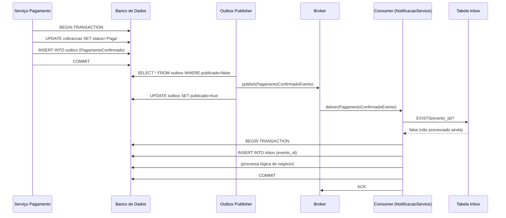

# Padrões de Confiabilidade em Sistemas Event-Driven

> **Pré-requisito**: [Kafka](./04-kafka.md) e/ou [RabbitMQ](./05-rabbitmq.md)  
> **Leitura complementar**: [Event Sourcing](./02-event-sourcing.md)

---

## Por que confiabilidade é um problema especial em EDA?

Em sistemas síncronos, a confiabilidade é relativamente simples: uma transação SQL
garante atomicidade — ou tudo ocorre, ou nada ocorre.

Em sistemas assíncronos orientados a eventos, surge uma lacuna:

```
Transação banco: cobranca.Status = Paga  → COMMIT (atômico)
Publicação no broker: await broker.PublicarAsync(PagamentoConfirmadoEvento)

Problema: e se o banco fizer COMMIT mas o broker estiver fora do ar?
  → Status no banco = Paga
  → Evento nunca publicado
  → NotificacaoService nunca soube
  → AntiFraudeService nunca registrou
  → Inconsistência silenciosa no sistema
```

Os padrões deste documento resolvem exatamente esse problema — e os problemas que surgem
da solução.

---

## Padrão 1 — Transactional Outbox

### O problema

Você não pode garantir atomicidade entre:
- Um COMMIT no banco de dados
- Uma publicação no broker de mensagens

São dois sistemas diferentes. Transações distribuídas são custosas e rígidas.

### A solução

**Nunca publique diretamente no broker.** Em vez disso, dentro da mesma transação que
modifica o estado do negócio, insira o evento em uma tabela `outbox` no mesmo banco.
Um processo separado (o **outbox publisher**) lê a tabela e publica no broker.

```
SEM OUTBOX (problema):

  BEGIN TRANSACTION
    UPDATE cobrancas SET status = 'Paga'   ← banco
  COMMIT
  await broker.PublicarAsync(PagamentoConfirmadoEvento)  ← broker (FORA da transação)
  ← Se falhar aqui: banco atualizado, evento nunca publicado

COM OUTBOX (solução):

  BEGIN TRANSACTION
    UPDATE cobrancas SET status = 'Paga'
    INSERT INTO outbox (tipo, payload, criado_em, publicado)
           VALUES ('PagamentoConfirmado', '{...}', now(), false)
  COMMIT
  ← Banco e outbox estão sempre em sync — mesma transação
  ← Broker pode falhar — o evento não foi perdido, está na tabela outbox
```

### O Outbox Publisher

Um processo separado — um background job, um worker, um CDC — lê a tabela outbox
e publica as mensagens não publicadas:

```csharp
// Outbox Publisher — executa periodicamente (polling) ou via CDC (push)
public class OutboxPublisher(IDbConnection db, IMessageBroker broker)
{
    public async Task PublicarPendentesAsync(CancellationToken ct)
    {
        var pendentes = await db.QueryAsync<OutboxMensagem>(
            "SELECT * FROM outbox WHERE publicado = false ORDER BY criado_em LIMIT 100");

        foreach (var msg in pendentes)
        {
            await broker.PublicarAsync(msg.Tipo, msg.Payload);

            await db.ExecuteAsync(
                "UPDATE outbox SET publicado = true, publicado_em = now() WHERE id = @Id",
                new { msg.Id });
        }
    }
}
```

### A garantia resultante

O Outbox garante **at-least-once** para a publicação: se o publisher falha depois de
publicar mas antes de marcar como publicado, a mensagem é publicada novamente na próxima
execução. Por isso o consumer precisa ser idempotente (veja Inbox Pattern abaixo).

```
Diagrama completo:

  [Serviço de Pagamento]
       │
       │ BEGIN TRANSACTION
       │  UPDATE cobrancas
       │  INSERT outbox
       │ COMMIT
       │
       ▼
  [Tabela Outbox] ──► [Outbox Publisher] ──► [Broker]
                            │                    │
                            │ UPDATE publicado=true
                            ▼
                       [Tabela Outbox atualizada]
```

### Implementações

**Polling simples**: o publisher executa a cada N segundos e lê mensagens pendentes.
Simples de implementar, latência proporcional ao intervalo de polling.

**CDC (Change Data Capture)**: ferramentas como **Debezium** monitoram o transaction log
do banco e publicam mudanças em tempo real, eliminando o polling e a latência.

```
PostgreSQL WAL → Debezium → Kafka (outbox topic) → destino final
```

### Limpeza da tabela

```sql
-- Manter apenas os últimos 7 dias de mensagens publicadas
DELETE FROM outbox
WHERE publicado = true
  AND publicado_em < now() - INTERVAL '7 days';
```

---

## Padrão 2 — Inbox Pattern (Deduplicação)

### O problema

At-least-once delivery — a garantia prática de Kafka e RabbitMQ — significa que um
consumer **pode receber a mesma mensagem mais de uma vez**:

```
Cenário:
  1. Consumer recebe PagamentoConfirmadoEvento
  2. Consumer processa: debita do extrato, envia SMS ✓
  3. Consumer vai fazer ACK/commit do offset
  4. Consumer cai antes do ACK
  5. Na reconexão, broker reenvia PagamentoConfirmadoEvento
  6. Consumer processa de novo: debita do extrato DUAS VEZES, envia SMS DUAS VEZES
```

Sem tratamento, at-least-once pode causar double-spending, SMS duplicado, débito duplicado.

### A solução — Inbox Pattern

O consumer mantém uma tabela de mensagens já processadas. Antes de processar qualquer
mensagem, verifica se já processou aquela com o mesmo ID:

```csharp
public class PagamentoConfirmadoHandler(IDbConnection db, IExtratoService extrato)
{
    public async Task HandleAsync(PagamentoConfirmadoEvento evento)
    {
        // 1. Verificar se já processamos este evento
        var jaProcessado = await db.QuerySingleAsync<bool>(
            "SELECT EXISTS(SELECT 1 FROM inbox WHERE mensagem_id = @Id)",
            new { Id = evento.EventoId });

        if (jaProcessado)
        {
            // Idempotência: ignorar silenciosamente
            return;
        }

        // 2. Processar dentro de uma transação com o registro no inbox
        await using var tx = await db.BeginTransactionAsync();

        await extrato.RegistrarDebitoAsync(evento.CpfPagador, evento.Valor);

        await db.ExecuteAsync(
            "INSERT INTO inbox (mensagem_id, tipo, processado_em) VALUES (@Id, @Tipo, now())",
            new { Id = evento.EventoId, Tipo = nameof(PagamentoConfirmadoEvento) });

        await tx.CommitAsync();
        // ACK/commit do offset só depois do COMMIT — at-least-once garantido
    }
}
```

### A tabela inbox

```sql
CREATE TABLE inbox (
    mensagem_id  UUID          PRIMARY KEY,  -- ID único do evento (vem no payload)
    tipo         VARCHAR(100)  NOT NULL,
    processado_em TIMESTAMPTZ  NOT NULL DEFAULT NOW()
);

-- Limpeza periódica (inbox cresce indefinidamente sem ela)
DELETE FROM inbox WHERE processado_em < now() - INTERVAL '30 days';
```

### O que é "ID único da mensagem"?

Cada evento precisa de um **ID globalmente único** que identifica aquela ocorrência
específica do evento — não o ID da entidade, mas o ID do evento em si.

```csharp
public abstract record BaseEvento
{
    public Guid EventoId { get; init; } = Guid.NewGuid();   // ID único do evento
    public DateTime OcorridoEm { get; init; } = DateTime.UtcNow;
}

public sealed record PagamentoConfirmadoEvento : BaseEvento
{
    public Guid CobrancaId { get; init; }   // ID da entidade (pode repetir em repub)
    public decimal Valor { get; init; }
}
```

**Importante**: `CobrancaId` é o ID da cobrança — pode aparecer em múltiplos eventos
diferentes. `EventoId` é o ID desta ocorrência específica do evento — único no universo.

---

## Padrão 3 — Idempotência

Idempotência é a propriedade de uma operação que pode ser executada múltiplas vezes
com o mesmo resultado. O Inbox Pattern é uma forma de implementar idempotência,
mas há outras estratégias dependendo do contexto.

### Idempotência por chave de negócio

Para operações como "criar pagamento", a chave de negócio pode ser usada como
idempotency key:

```csharp
// Cliente envia com idempotency key para evitar dupla cobrança
POST /pagamentos
Headers: Idempotency-Key: "cobranca-abc-123-tentativa-1"
Body: { "valor": 500, "metodo": "pix" }

// Primeira requisição: processa normalmente
// Segunda requisição com a mesma key: retorna o resultado da primeira
//   sem processar novamente
```

No banco:

```sql
-- Tabela de idempotency keys
CREATE TABLE idempotency_keys (
    chave       VARCHAR(200)  PRIMARY KEY,
    resposta    JSONB,
    criado_em   TIMESTAMPTZ   NOT NULL DEFAULT NOW()
);

-- Antes de processar:
INSERT INTO idempotency_keys (chave) VALUES (@Chave)
ON CONFLICT (chave) DO NOTHING;  -- Se já existe, não processa
```

### Idempotência natural vs implementada

Algumas operações são **naturalmente idempotentes**:
- `SET status = 'Paga'` — pode ser executado N vezes com o mesmo resultado
- `INSERT ... ON CONFLICT DO NOTHING` — não duplica registros

Outras precisam ser implementadas:
- `UPDATE saldo = saldo - 500` — executar duas vezes subtrai 1000 (ERRADO)
- `INSERT INTO extrato` — sem deduplicação, cria duas linhas

**Regra**: sempre verifique se a operação é naturalmente idempotente antes de
implementar o Inbox Pattern. Se for, o tratamento é mais simples.

---

## Padrão 4 — Retry com Backoff Exponencial e Dead Letter

### O problema

Uma mensagem falhou no processamento. O que fazer?

Há dois tipos de falha:
- **Transitória**: serviço downstream temporariamente indisponível, timeout de rede
- **Permanente**: dado inválido, bug que sempre vai falhar com aquele payload

Para falhas transitórias: retry com backoff. Para permanentes: DLQ.

### Retry com backoff exponencial

```
Tentativa 1: falhou → esperar 1 segundo → tentar de novo
Tentativa 2: falhou → esperar 2 segundos
Tentativa 3: falhou → esperar 4 segundos
Tentativa 4: falhou → esperar 8 segundos
Tentativa 5: falhou → DLQ (desistiu após 5 tentativas)
```

O backoff exponencial evita **retry storm**: sem ele, todos os consumers tentariam
ao mesmo tempo, sobrecarregando ainda mais um serviço já em dificuldades.

**Jitter**: adicionar variação aleatória ao intervalo de espera distribui as retentativas
no tempo, evitando que todos os consumers tentem exatamente ao mesmo tempo.

```csharp
var intervaloBase = TimeSpan.FromSeconds(1);
var tentativa = 1;

while (tentativa <= maxTentativas)
{
    try
    {
        await ProcessarMensagem(msg);
        break;  // sucesso
    }
    catch (ServicoIndisponivelException)
    {
        var backoff = intervaloBase * Math.Pow(2, tentativa);
        var jitter = TimeSpan.FromMilliseconds(Random.Shared.Next(0, 1000));
        await Task.Delay(backoff + jitter);
        tentativa++;
    }
}

if (tentativa > maxTentativas)
    await EnviarParaDlq(msg);
```

### Poison Messages

Uma **poison message** (mensagem envenenada) é uma mensagem que sempre falha —
geralmente por payload inválido, bug de desserialização ou invariante de negócio
impossível de satisfazer.

```
Poison message sem DLQ:
  1. Consumer tenta processar → exceção
  2. NACK → volta para fila
  3. Consumer tenta de novo → mesma exceção
  4. Loop infinito — consumer nunca avança, fila fica bloqueada

Poison message com DLQ:
  1. Consumer tenta processar → exceção
  2. Após 3 tentativas → NACK com requeue=false → DLQ
  3. Consumer avança → fila desbloqueia
  4. Equipe inspeciona DLQ → diagnóstica e decide o que fazer
```

**DLQ é obrigatória em produção.** Um sistema sem DLQ que recebe uma poison message
pode travar completamente.

---

## Garantias de entrega — resumo

| Garantia | Comportamento | Implementação | Quando usar |
|---|---|---|---|
| **At-most-once** | Pode perder, nunca duplica | Auto-commit antes de processar | Logs, métricas, dados não críticos |
| **At-least-once** | Pode duplicar, nunca perde | Commit/ACK após processar | Padrão — complementar com Inbox Pattern |
| **Exactly-once** | Nunca perde, nunca duplica | Transações distribuídas ou Outbox + Inbox | Domínios financeiros críticos |

**Sobre exactly-once**: "exactly-once" no Kafka tem uma definição precisa (EOS) válida
para fluxos topic-to-topic dentro do ecossistema Kafka. Para sistemas que envolvem bancos
externos, a combinação **Outbox + Inbox** é a forma pragmática de alcançar exactly-once
semântico sem transações distribuídas.

---

## O ciclo completo de confiabilidade



---

## Resumo

- **O problema central**: atomicidade entre banco e broker não existe nativamente
- **Outbox Pattern**: escreva no banco e na tabela outbox na mesma transação; publique no broker depois
- **Inbox Pattern**: registre o ID do evento no inbox antes de processar; ignore duplicatas
- **Idempotência**: design a operação de forma que executar N vezes produza o mesmo resultado
- **Retry com backoff**: tente novamente com espera crescente; jitter distribui as tentativas
- **DLQ é obrigatória**: sem ela, poison messages bloqueiam o consumer indefinidamente
- **At-least-once + Inbox = exactly-once semântico** — o padrão pragmático de produção

---

## Perguntas para fixação

1. Por que não é possível garantir atomicidade entre banco e broker sem o Outbox Pattern?
2. O que acontece se o Outbox Publisher falha depois de publicar mas antes de marcar como publicado?
3. Por que o Inbox Pattern precisa registrar no inbox e processar na **mesma transação**?
4. Qual a diferença entre at-least-once e exactly-once no contexto de mensageria?
5. O que é uma poison message e por que ela é perigosa sem DLQ?
6. Por que adicionar jitter ao backoff exponencial?
7. Quando faz sentido usar CDC (Debezium) em vez de polling no Outbox Publisher?

---

## Perguntas de entrevista

**Iniciante**

> O que é at-least-once delivery?

At-least-once significa que a mensagem será entregue ao consumer pelo menos uma vez.
Se o consumer cair antes de confirmar o recebimento (ACK/commit), o broker reenvia a
mensagem. A consequência é que o consumer pode receber a mesma mensagem mais de uma vez.

**Intermediário**

> O que é o Transactional Outbox Pattern e por que é necessário?

Outbox Pattern resolve o problema de publicar eventos no broker de forma atômica com
a escrita no banco. Sem ele, um COMMIT no banco seguido de falha na publicação no broker
cria inconsistência silenciosa: o estado foi atualizado, mas os outros serviços não
foram notificados. A solução é escrever o evento em uma tabela outbox na mesma transação
do banco, e um processo separado publica o outbox no broker. Garante at-least-once
para a publicação.

> O que é o Inbox Pattern?

O Inbox Pattern garante idempotência no consumer: antes de processar uma mensagem,
verifica se o ID do evento já está registrado na tabela inbox. Se sim, descarta
silenciosamente. Se não, processa e registra no inbox — tudo na mesma transação.
Resolve o problema do at-least-once delivery onde a mesma mensagem pode ser entregue
mais de uma vez.

**Avançado**

> Como você implementaria exactly-once semântico end-to-end (banco + broker) sem transações distribuídas?

Combinação Outbox + Inbox: (1) Outbox: no producer, escreva o evento na tabela outbox
na mesma transação do banco — garante que o evento não é perdido mesmo se o broker falha.
O Outbox Publisher publica no broker com at-least-once. (2) Inbox: no consumer, registre
o ID do evento no inbox e processe na mesma transação — garante que processar duas vezes
produz o mesmo resultado que processar uma vez. O resultado combinado é semanticamente
equivalente a exactly-once sem necessitar de protocolos de transação distribuída.

---

## Relação com outros documentos

- [Event-Driven Architecture](./01-event-driven-vs-sourcing.md) — contexto de por que confiabilidade é um desafio em EDA
- [Event Sourcing](./02-event-sourcing.md) — o event store é append-only, mas a publicação dos eventos para o broker ainda exige Outbox
- [Kafka](./04-kafka.md) — commit de offsets, EOS, consumer lag
- [RabbitMQ](./05-rabbitmq.md) — ACK/NACK, prefetch, DLQ