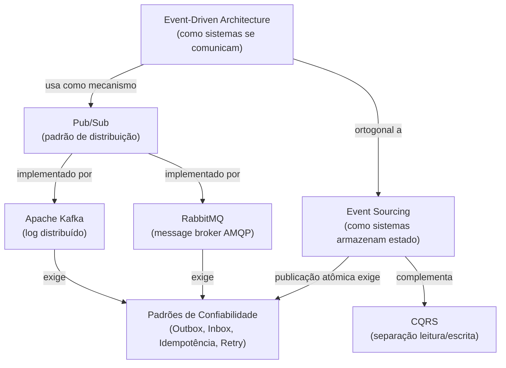

# Event-Driven Architecture — Guia de Estudo

Este módulo cobre Event-Driven Architecture e os conceitos necessários para projetar,
implementar e operar sistemas orientados a eventos.

---

## O que você vai aprender

Ao terminar este material, você será capaz de:

- Explicar o que é EDA e por que ela existe — e quando ela piora o sistema
- Distinguir Evento, Comando e Mensagem com precisão
- Compreender Event Sourcing como padrão de persistência (não de comunicação)
- Explicar como Kafka funciona internamente: log, partitions, offsets, consumer groups
- Explicar como RabbitMQ funciona: exchanges, bindings, ACK/NACK, DLQ
- Entender Pub/Sub como padrão, não como tecnologia
- Implementar os padrões de confiabilidade: Outbox, Inbox, idempotência, retry
- Tomar decisões arquiteturais justificadas: quando usar Kafka vs RabbitMQ vs REST

---

## Pré-requisitos

- Familiaridade com REST e HTTP
- Noções básicas de banco de dados relacional (transações, SQL)
- Conceito de microsserviços (não precisa ser expert — o material referencia quando necessário)

---

## Mapa conceitual



---

## Trilha de estudo recomendada

```
1. Fundamentos de EDA
   └── 01-event-driven-vs-sourcing.md
       Vocabulário (Evento, Comando, Mensagem)
       Padrões estruturais (Event Notification, ECST, Event Collaboration)
       EDA vs Event Sourcing — a distinção fundamental

2. Persistência com eventos
   └── 02-event-sourcing.md
       Aggregate, EventStore, Replay, Snapshots
       Projections e CQRS
       Schema evolution

3. Padrão de distribuição
   └── 03-pub-sub.md
       Pub/Sub como padrão (não tecnologia)
       Fan-out vs Competing Consumers
       Backpressure

4. Tecnologias de mensageria
   ├── 04-kafka.md
   │   Log distribuído, partitions, consumer groups, offsets
   │   Ordering, replay, schema evolution, consumer lag
   └── 05-rabbitmq.md
       Exchanges, bindings, ACK/NACK, prefetch, DLQ
       Kafka vs RabbitMQ — quando usar cada um

5. Confiabilidade
   └── 06-reliability-patterns.md
       Outbox Pattern — publicação atômica
       Inbox Pattern — idempotência no consumer
       Retry, backoff, poison messages, DLQ
```

---

## Descrição dos documentos

| Documento | Conteúdo central | Conceitos-chave |
|---|---|---|
| [01-event-driven-vs-sourcing.md](./01-event-driven-vs-sourcing.md) | Fundamentos de EDA — o que é, por que existe, vocabulário | Evento, Comando, Mensagem; desacoplamento espacial/temporal; EDA ≠ Event Sourcing |
| [02-event-sourcing.md](./02-event-sourcing.md) | Event Sourcing — persistência por eventos | Aggregate, EventStore, Replay, Snapshot, Projections, CQRS |
| [03-pub-sub.md](./03-pub-sub.md) | Pub/Sub como padrão de comunicação | Fan-out, Competing Consumers, Backpressure |
| [04-kafka.md](./04-kafka.md) | Apache Kafka — log distribuído | Partition, Offset, Consumer Group, Replay, Consumer Lag |
| [05-rabbitmq.md](./05-rabbitmq.md) | RabbitMQ — broker AMQP | Exchange (Direct/Fanout/Topic/Headers), ACK/NACK, Prefetch, DLQ |
| [06-reliability-patterns.md](./06-reliability-patterns.md) | Padrões de confiabilidade | Transactional Outbox, Inbox Pattern, Idempotência, Retry |

---

## As confusões mais comuns — desambiguação rápida

**"EDA é Event Sourcing"**  
Não. EDA define como sistemas se comunicam. Event Sourcing define como um sistema
armazena estado. São ortogonais: você pode ter um sem o outro.

**"Kafka é uma fila"**  
Kafka é um log distribuído. A diferença: mensagens consumidas permanecem no log,
habilitando replay e consumer groups independentes. Dentro de um consumer group,
se comporta como fila; entre groups, como Pub/Sub.

**"Pub/Sub é uma tecnologia"**  
Pub/Sub é um padrão de comunicação. Kafka, RabbitMQ, Azure Service Bus e Google Cloud
Pub/Sub são tecnologias que implementam o padrão.

**"Kafka é melhor que RabbitMQ"**  
São ferramentas com modelos diferentes para problemas diferentes. Kafka é superior para
streaming de alto volume com replay. RabbitMQ é superior para roteamento complexo, RPC
e filas de tarefas com DLQ sofisticada.

**"At-least-once é suficiente sem tratamento adicional"**  
At-least-once pode causar processamento duplicado. Sem Inbox Pattern (idempotência),
o mesmo pagamento pode ser debitado duas vezes. At-least-once é seguro apenas com
consumers idempotentes.

---

## Garantias de entrega — resumo rápido

| Garantia | Comportamento | Custo |
|---|---|---|
| **At-most-once** | Pode perder, nunca duplica | Baixo — adequado para logs, métricas |
| **At-least-once** | Pode duplicar, nunca perde | Médio — padrão, requer Inbox Pattern |
| **Exactly-once** | Nunca perde, nunca duplica | Alto — Outbox + Inbox, ou EOS Kafka |

---

## Kafka vs RabbitMQ — decisão rápida

| Critério | Escolha |
|---|---|
| Alto volume (milhões/s) + retenção + replay | Kafka |
| Múltiplos consumer groups independentes | Kafka |
| Event Sourcing em larga escala | Kafka |
| Roteamento complexo por tipo/conteúdo | RabbitMQ |
| Request-Reply (RPC sobre mensageria) | RabbitMQ |
| Filas de tarefas com DLQ sofisticada | RabbitMQ |
| TTL de mensagens (expiração) | RabbitMQ |
| Operação simples, equipe pequena | RabbitMQ |

---

## O que estudar depois

Este módulo cobre o núcleo de Event-Driven Architecture. Os próximos passos naturais:

- **Saga Pattern** — transações distribuídas entre microsserviços (módulo Microservices)
- **Event Mesh e Event-Driven Integration** — integração de sistemas via eventos em escala corporativa
- **Kafka Streams / ksqlDB** — processamento de streams em tempo real
- **Schema Registry e Apache Avro** — gestão de schemas em escala
- **OpenTelemetry** — tracing distribuído entre serviços event-driven
- **KEDA (Kubernetes Event-Driven Autoscaling)** — auto-scaling baseado em consumer lag

---

## Projetos do módulo

```
src/EventDriven/
├── ArchitectureLab.EventDriven.Shared/        ← DomainEvent, AggregateEvent, Result<T>
├── ArchitectureLab.EventDriven.EDA/            ← EDA com fan-out
├── ArchitectureLab.EventDriven.EventSourcing/  ← Aggregate, EventStore, Snapshot, Projection
├── ArchitectureLab.EventDriven.Messaging/      ← Kafka e RabbitMQ simulados
└── ArchitectureLab.EventDriven.Tests/          ← Testes cobrindo todos os padrões
```